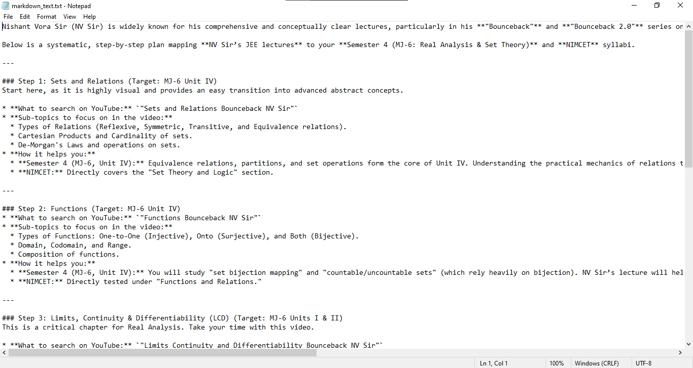
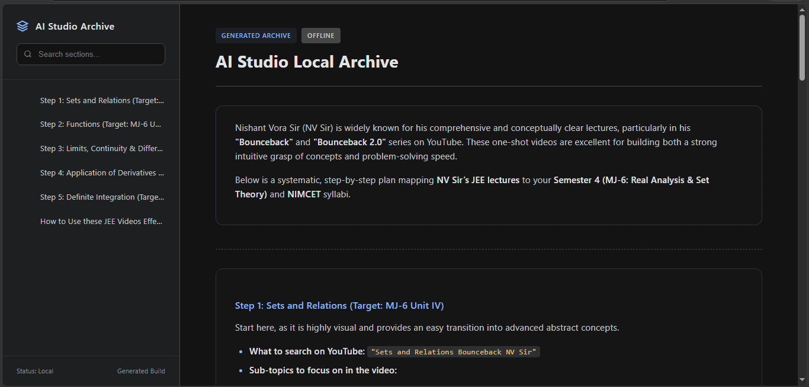

# Markdown to HTML

A simple Python tool that converts Markdown (`.md`) files into clean HTML pages.

## Features

- Convert Markdown files to HTML
- Fast and lightweight
- Easy to use
- Suitable for notes, documentation, and static web pages

## Requirements

- Python 3.x
- markdown library

## Installation

Install the required package:

```bash
pip install markdown
```

## Usage

Run the script:

```bash
python generate_html.py
```

The script will convert the Markdown file into an HTML file.

## Example

### Markdown Input

```markdown
# Hello World

This is a markdown file.

- Item 1
- Item 2
```

### HTML Output

```html
<h1>Hello World</h1>
<p>This is a markdown file.</p>
<ul>
  <li>Item 1</li>
  <li>Item 2</li>
</ul>
```

## Screenshots

### Markdown Input



### HTML Output


## Author

Anurag Kumar

## License

This project is open source and available for learning and personal use.